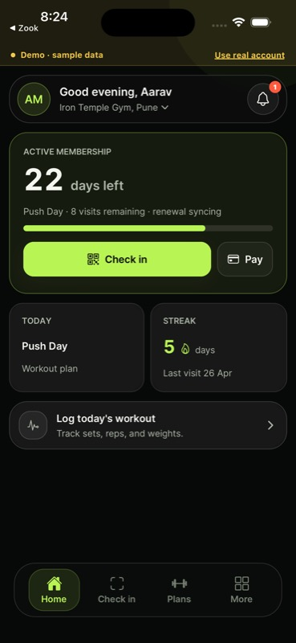
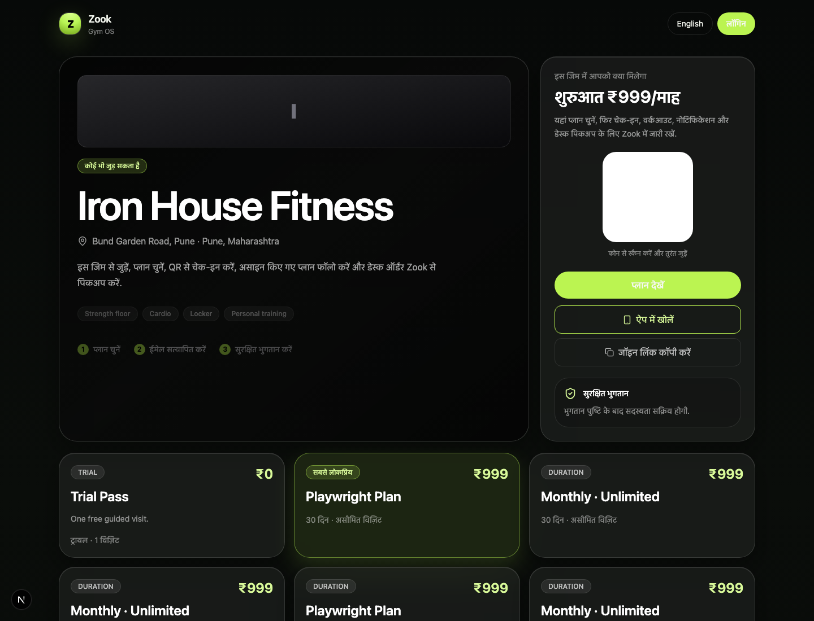
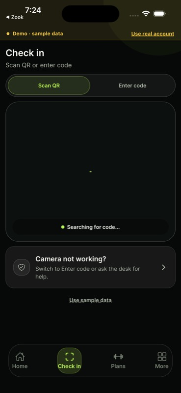

# Member Handbook

## Test Accounts

- Fresh start: `fresh@zook.local` or `+91 90000 11111`, OTP `000000`.
- Complete demo: `member@zook.local` or `+91 98765 43210`, OTP `000000`.

## What Members Can Do

- Find verified gyms by city, name, handle, rating, price, and join mode.
- Open a public gym profile, compare visible plans, review trust signals, and continue on phone.
- Join an open gym immediately or send a request when approval is required.
- Pay securely through the checkout flow and land back with a clear membership state.
- See active membership first: days left, plan name, renewal date, visit status, and the single check-in action.
- Check in by scanning a QR code or entering a desk code when the camera is unavailable.
- Review plans and training from a trainer: workout, diet, and habits live under one Plans area.
- Track workouts, active time, weight, habits, and last workout without color competing for meaning.
- Browse shop items, place orders, track order status, and see payment state.
- Manage profile, phone/email verification, notification preferences, privacy consent, and guardian consent when needed.

## Web Entry Points

- `/find` discovers gyms.
- `/g/[username]` shows the public gym profile.
- `/join/[username]` starts public joining.
- `/r/[code]` opens referral joining.
- `/checkout/[sessionId]` completes payment.

## Mobile Entry Points

- `/` opens the member home.
- `/scan` opens check-in.
- `/plans` opens Plans and training.
- `/membership` opens the active membership.
- `/shop` and `/order/[orderId]` cover shop and order state.
- `/notifications`, `/profile`, and `/settings` cover account controls.

## Smooth UX Rules

- One filled lime button per screen.
- State before story: days left, payment state, approval state, or sync state comes before detail.
- Demo state is a top strip, never a floating badge over content.
- Empty, loading, and error states should always explain the next action.
