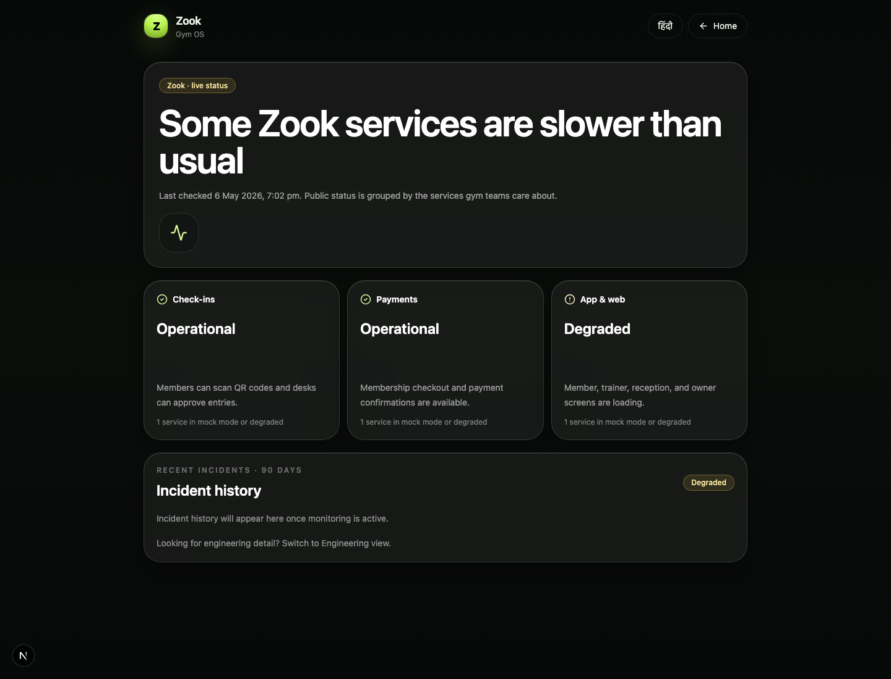

# Platform Status Handbook

## What The Status Page Does

- Shows user-facing health for Check-ins, Payments, and App and web.
- Keeps engineering provider detail behind an engineering view.
- Shows recent incidents and uptime in language a gym owner can understand.
- Lets users subscribe to updates.

## Smooth UX Rules

- Public copy answers: is the gym software working?
- Infrastructure labels like Razorpay, Expo, OpenAI, storage, and push providers belong in engineering detail.
- Sandbox or mock mode should be translated into user impact.
- Status cards should stay calm, factual, and short.
